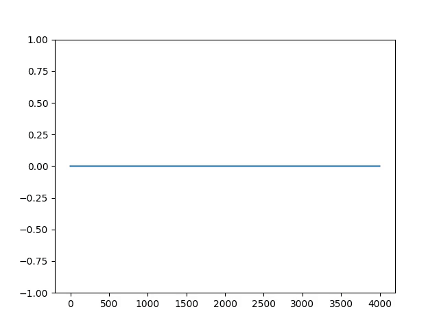
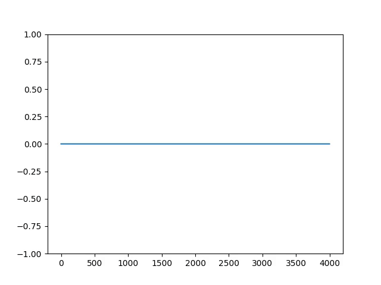
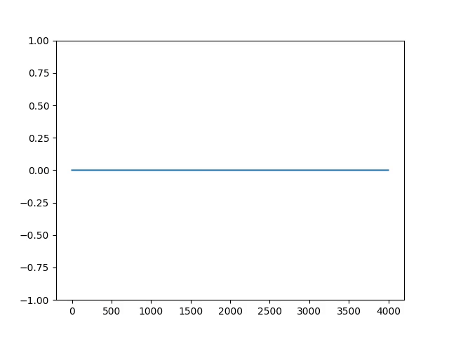

# 🚀 1D FDTD Simulations  

This repository contains **1D Finite-Difference Time-Domain (FDTD)** simulations for solving **Maxwell’s equations**. Starting from the basics, we progressively build towards advanced absorbing boundary conditions (ABCs) and Perfectly Matched Layers (PMLs).  

---

## 📖 Background  
We solve the following Maxwell’s curl equations:  

\[
\frac{\partial H_z}{\partial t} = \frac{1}{\mu_0} \frac{\partial E_x}{\partial y}, \quad
\frac{\partial E_x}{\partial t} = \frac{1}{\epsilon_0} \frac{\partial H_z}{\partial y}
\]

These are discretized using the **FDTD algorithm** and extended with absorbing boundaries step by step:  

1. **Mur ABC** – Simple and effective for 1D.  
2. **Naive PML** – Introduces absorption via constant conductivity.  
3. **Graded PML** – Conductivity increases exponentially for better absorption.  
4. **CPML** – Industry-standard, absorbs waves at any incident angle.  

All methods are based on **Allen Taflove’s FDTD book** and cross-referenced with **Joshua Baxter PhD’s GitHub and YouTube resources**.  

---

## 🧪 Simulation Setup  
- **Excitation:** Sinusoidal signal wrapped in a Gaussian.  
- **Configuration:** Parameters are controlled via a `json` file.  
- **Examples:** A sample test case is provided in the `test/` directory.  

---

## 📂 Project Structure  
- `01_fdtd_abc.cpp` → Mur ABC implementation.  
- `02_fdtd_naive_pml.cpp` → Naive PML.  
- `03_fdtd_graded_pml.cpp` → Graded PML.  
- `04_fdtd_cpml.cpp` → Convolutional PML (CPML).  
- `videos/` → Step-by-step video demos.  
- `script.sh` → Automates video generation.  
- `python/` → Scripts for plots and animations.  

---

## 🌟 Why This Progression?  
- **Mur ABC** is perfect for 1D but fails in higher dimensions.  
- **Naive PML** shows absorption but with reflections.  
- **Graded PML** removes reflections in 1D but fails for angled incidence.  
- **CPML** solves it all—robust across dimensions and angles.  

---

## 🎥 Visualizations  
All simulations are visualized. Videos can be generated via `script.sh`, and Python scripts create plots/animations.  

---
## 🎥 Simulation Demos  

### 1. Mur ABC  
  

### 2. Naive PML  
  

### 3. Graded PML  
  

### 4. CPML  
  

## 📚 References  
- Taflove, A. *Computational Electrodynamics: The Finite-Difference Time-Domain Method*  
- Griffiths, D. J. *Introduction to Electrodynamics*  
- [Joshua Baxter PhD – GitHub & YouTube](https://github.com/joshuabaxterphd)  
